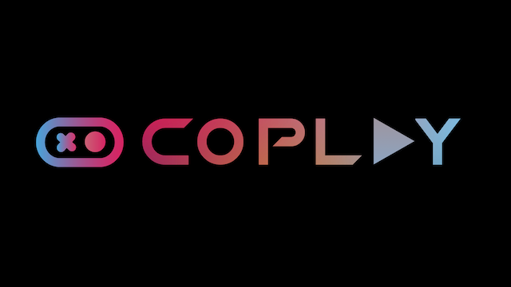

# MCP for Unity ✨

#### Proudly sponsored and maintained by [Coplay](https://www.coplay.dev/?ref=unity-mcp), the AI assistant for Unity. [Read the backstory here.](https://www.coplay.dev/blog/coplay-and-open-source-unity-mcp-join-forces)

[](https://discord.gg/y4p8KfzrN4)
[](https://unity.com/releases/editor/archive)
[](https://www.python.org)
[](https://modelcontextprotocol.io/introduction)


[](https://opensource.org/licenses/MIT)
[](https://www.coplay.dev/?ref=unity-mcp)

**Create your Unity apps with LLMs!**

MCP for Unity acts as a bridge, allowing AI assistants (like Claude, Cursor) to interact directly with your Unity Editor via a local **MCP (Model Context Protocol) Client**. Give your LLM tools to manage assets, control scenes, edit scripts, and automate tasks within Unity.

## 💬 Join Our Community

### [Discord](https://discord.gg/y4p8KfzrN4)

**Get help, share ideas, and collaborate with other MCP for Unity developers!**  

---

## Key Features 🚀

*   **🗣️ Natural Language Control:** Instruct your LLM to perform Unity tasks.
*   **🛠️ Powerful Tools:** Manage assets, scenes, materials, scripts, and editor functions.
*   **🤖 Automation:** Automate repetitive Unity workflows.
*   **🧩 Extensible:** Designed to work with various MCP Clients.

<details open>
  <summary><strong> Available Tools </strong></summary>

  Your LLM can use functions like:

  *   `read_console`: Gets messages from or clears the console.
  *   `manage_script`: Manages C# scripts (create, read, update, delete).
  *   `manage_editor`: Controls and queries the editor\'s state and settings.
  *   `manage_scene`: Manages scenes (load, save, create, get hierarchy, etc.).
  *   `manage_asset`: Performs asset operations (import, create, modify, delete, etc.).
  *   `manage_shader`: Performs shader CRUD operations (create, read, modify, delete).
  *   `manage_gameobject`: Manages GameObjects: create, modify, delete, find, and component operations.
  *   `execute_menu_item`: Executes a menu item via its path (e.g., "File/Save Project").
</details>

---

## How It Works 🤔

MCP for Unity connects your tools using two components:

1.  **MCP for Unity Bridge:** A Unity package running inside the Editor. (Installed via Package Manager).
2.  **MCP for Unity Server:** A Python server that runs locally, communicating between the Unity Bridge and your MCP Client. (Installed automatically by the package on first run or via Auto-Setup; manual setup is available as a fallback).

**Flow:** `[Your LLM via MCP Client] <-> [MCP for Unity Server (Python)] <-> [MCP for Unity Bridge (Unity Editor)]`

---

## Installation ⚙️

> **Note:** The setup is constantly improving as we update the package. Check back if you randomly start to run into issues.

### Prerequisites

  *   **Python:** Version 3.12 or newer. [Download Python](https://www.python.org/downloads/)
  *   **Unity Hub & Editor:** Version 2021.3 LTS or newer. [Download Unity](https://unity.com/download)
  *   **uv (Python package manager):**
      ```bash
      pip install uv
      # Or see: https://docs.astral.sh/uv/getting-started/installation/
      ```
  *   **An MCP Client:**
      *   [Claude Desktop](https://claude.ai/download)
      *   [Claude Code](https://github.com/anthropics/claude-code)
      *   [Cursor](https://www.cursor.com/en/downloads)
      *   [Visual Studio Code Copilot](https://code.visualstudio.com/docs/copilot/overview)
      *   [Windsurf](https://windsurf.com)
      *   *(Others may work with manual config)*
 *    <details> <summary><strong>[Optional] Roslyn for Advanced Script Validation</strong></summary>

        For **Strict** validation level that catches undefined namespaces, types, and methods: 

        **Method 1: NuGet for Unity (Recommended)**
        1. Install [NuGetForUnity](https://github.com/GlitchEnzo/NuGetForUnity)
        2. Go to `Window > NuGet Package Manager`
        3. Search for `Microsoft.CodeAnalysis.CSharp` and install the package
        5. Go to `Player Settings > Scripting Define Symbols`
        6. Add `USE_ROSLYN`
        7. Restart Unity

        **Method 2: Manual DLL Installation**
        1. Download Microsoft.CodeAnalysis.CSharp.dll and dependencies from [NuGet](https://www.nuget.org/packages/Microsoft.CodeAnalysis.CSharp/)
        2. Place DLLs in `Assets/Plugins/` folder
        3. Ensure .NET compatibility settings are correct
        4. Add `USE_ROSLYN` to Scripting Define Symbols
        5. Restart Unity

        **Note:** Without Roslyn, script validation falls back to basic structural checks. Roslyn enables full C# compiler diagnostics with precise error reporting.</details>

### 🌟Step 1: Install the Unity Package🌟

#### To install via Git URL

1.  Open your Unity project.
2.  Go to `Window > Package Manager`.
3.  Click `+` -> `Add package from git URL...`.
4.  Enter:
    ```
    https://github.com/CoplayDev/unity-mcp.git?path=/UnityMcpBridge
    ```
5.  Click `Add`.
6. The MCP server is installed automatically by the package on first run or via Auto-Setup. If that fails, use Manual Configuration (below).

#### To install via OpenUPM

1.  Instal the [OpenUPM CLI](https://openupm.com/docs/getting-started-cli.html)
2.  Open a terminal (PowerShell, Terminal, etc.) and navigate to your Unity project directory
3.  Run `openupm add com.coplaydev.unity-mcp`

**Note:** If you installed the MCP Server before Coplay's maintenance, you will need to uninstall the old package before re-installing the new one.

### Step 2: Configure Your MCP Client

Connect your MCP Client (Claude, Cursor, etc.) to the Python server set up in Step 1 (auto) or via Manual Configuration (below).


**Option A: Auto-Setup (Recommended for Claude/Cursor/VSC Copilot)**

1.  In Unity, go to `Window > MCP for Unity`.
2.  Click `Auto-Setup`.
3.  Look for a green status indicator 🟢 and "Connected ✓". *(This attempts to modify the MCP Client\'s config file automatically).* 

<details><summary><strong>Client-specific troubleshooting</strong></summary>

  - **VSCode**: uses `Code/User/mcp.json` with top-level `servers.unityMCP` and `"type": "stdio"`. On Windows, MCP for Unity writes an absolute `uv.exe` (prefers WinGet Links shim) to avoid PATH issues.
  - **Cursor / Windsurf** [(**help link**)](https://github.com/CoplayDev/unity-mcp/wiki/1.-Fix-Unity-MCP-and-Cursor,-VSCode-&-Windsurf): if `uv` is missing, the MCP for Unity window shows "uv Not Found" with a quick [HELP] link and a "Choose `uv` Install Location" button.
  - **Claude Code** [(**help link**)](https://github.com/CoplayDev/unity-mcp/wiki/2.-Fix-Unity-MCP-and-Claude-Code): if `claude` isn't found, the window shows "Claude Not Found" with [HELP] and a "Choose Claude Location" button. Unregister now updates the UI immediately.</details>


**Option B: Manual Configuration**

If Auto-Setup fails or you use a different client:

1.  **Find your MCP Client\'s configuration file.** (Check client documentation).
    *   *Claude Example (macOS):* `~/Library/Application Support/Claude/claude_desktop_config.json`
    *   *Claude Example (Windows):* `%APPDATA%\Claude\claude_desktop_config.json`
2.  **Edit the file** to add/update the `mcpServers` section, using the *exact* paths from Step 1.

<details>
<summary><strong>Click for Client-Specific JSON Configuration Snippets...</strong></summary>

**VSCode (all OS)**

```json
{
  "servers": {
    "unityMCP": {
      "command": "uv",
      "args": ["--directory","<ABSOLUTE_PATH_TO>/UnityMcpServer/src","run","server.py"],
      "type": "stdio"
    }
  }
}
```

On Windows, set `command` to the absolute shim, e.g. `C:\\Users\\YOU\\AppData\\Local\\Microsoft\\WinGet\\Links\\uv.exe`.

**Windows:**

  ```json
  {
    "mcpServers": {
      "UnityMCP": {
        "command": "uv",
        "args": [
          "run",
          "--directory",
          "C:\\Users\\YOUR_USERNAME\\AppData\\Local\\Programs\\UnityMCP\\UnityMcpServer\\src",
          "server.py"
        ]
      }
      // ... other servers might be here ...
    }
  }
``` 

(Remember to replace YOUR_USERNAME and use double backslashes \\)

**macOS:**

```json
{
  "mcpServers": {
    "UnityMCP": {
      "command": "uv",
      "args": [
        "run",
        "--directory",
        "/usr/local/bin/UnityMCP/UnityMcpServer/src",
        "server.py"
      ]
    }
    // ... other servers might be here ...
  }
}
```

(Replace YOUR_USERNAME if using ~/bin)

**Linux:**

```json
{
  "mcpServers": {
    "UnityMCP": {
      "command": "uv",
      "args": [
        "run",
        "--directory",
        "/home/YOUR_USERNAME/bin/UnityMCP/UnityMcpServer/src",
        "server.py"
      ]
    }
    // ... other servers might be here ...
  }
}
```

(Replace YOUR_USERNAME)

**For Claude Code**

If you\'re using Claude Code, you can register the MCP server using these commands:

**macOS:**

```bash
claude mcp add UnityMCP -- uv --directory /[PATH_TO]/UnityMCP/UnityMcpServer/src run server.py
```

**Windows:**

```bash
claude mcp add UnityMCP -- "C:/Users/USERNAME/AppData/Roaming/Python/Python313/Scripts/uv.exe" --directory "C:/Users/USERNAME/AppData/Local/Programs/UnityMCP/UnityMcpServer/src" run server.py
```
</details>

---

## Usage ▶️

1. **Open your Unity Project.** The MCP for Unity package should connect automatically. Check status via Window > MCP for Unity.
    
2. **Start your MCP Client** (Claude, Cursor, etc.). It should automatically launch the MCP for Unity Server (Python) using the configuration from Installation Step 2.
    
3. **Interact!** Unity tools should now be available in your MCP Client.
    
    Example Prompt: `Create a 3D player controller`, `Create a yellow and bridge sun`, `Create a cool shader and apply it on a cube`.

---

## Future Dev Plans (Besides PR) 📝

### 🔴 High Priority

- [ ] **Asset Generation Improvements** - Enhanced server request handling and asset pipeline optimization
- [ ] **Code Generation Enhancements** - Improved generated code quality and error handling
- [ ] **Robust Error Handling** - Comprehensive error messages, recovery mechanisms, and graceful degradation
- [ ] **Remote Connection Support** - Enable seamless remote connection between Unity host and MCP server
- [ ] **Documentation Expansion** - Complete tutorials for custom tool creation and API reference

### 🟡 Medium Priority

- [ ] **Custom Tool Creation GUI** - Visual interface for users to create and configure their own MCP tools
- [ ] **Advanced Logging System** - Logging with filtering, export, and debugging capabilities

### 🟢 Low Priority

- [ ] **Mobile Platform Support** - Extended toolset for mobile development workflows and platform-specific features
- [ ] **Easier Tool Setup**
- [ ] **Plugin Marketplace** - Community-driven tool sharing and distribution platform

<details open>
  <summary><strong>✅ Completed Features<strong></summary>
  
  - [x] **Shader Generation** - Generate shaders using CGProgram template
  - [x] **Advanced Script Validation** - Multi-level validation with semantic analysis, namespace/type checking, and Unity best practices (Will need Roslyn Installed, see [Prerequisite](#prerequisites)).
</details>

### 🔬 Research & Exploration

- [ ] **AI-Powered Asset Generation** - Integration with AI tools for automatic 3D models, textures, and animations
- [ ] **Real-time Collaboration** - Live editing sessions between multiple developers *(Currently in progress)*
- [ ] **Analytics Dashboard** - Usage analytics, project insights, and performance metrics
- [ ] **Voice Commands** - Voice-controlled Unity operations for accessibility
- [ ] **AR/VR Tool Integration** - Extended support for immersive development workflows

---

## For Developers 🛠️

### Development Tools

If you\'re contributing to MCP for Unity or want to test core changes, we have development tools to streamline your workflow:

- **Development Deployment Scripts**: Quickly deploy and test your changes to MCP for Unity Bridge and Python Server
- **Automatic Backup System**: Safe testing with easy rollback capabilities  
- **Hot Reload Workflow**: Fast iteration cycle for core development
- **More coming!**

📖 **See [README-DEV.md](README-DEV.md)** for complete development setup and workflow documentation.

### Contributing 🤝

Help make MCP for Unity better!

1. **Fork** the main repository.
    
2. **Create a branch** (`feature/your-idea` or `bugfix/your-fix`).
    
3. **Make changes.**
    
4. **Commit** (feat: Add cool new feature).
    
5. **Push** your branch.
    
6. **Open a Pull Request** against the main branch.

---

## Troubleshooting ❓

<details>  
<summary><strong>Click to view common issues and fixes...</strong></summary>  

- **Unity Bridge Not Running/Connecting:**
    - Ensure Unity Editor is open.
    - Check the status window: Window > MCP for Unity.
    - Restart Unity.
- **MCP Client Not Connecting / Server Not Starting:**
    - **Verify Server Path:** Double-check the --directory path in your MCP Client\'s JSON config. It must exactly match the location where you cloned the UnityMCP repository in Installation Step 1 (e.g., .../Programs/UnityMCP/UnityMcpServer/src).
    - **Verify uv:** Make sure `uv` is installed and working (pip show uv).
    - **Run Manually:** Try running the server directly from the terminal to see errors: `# Navigate to the src directory first! cd /path/to/your/UnityMCP/UnityMcpServer/src uv run server.py`
    - **Permissions (macOS/Linux):** If you installed the server in a system location like /usr/local/bin, ensure the user running the MCP client has permission to execute uv and access files there. Installing in ~/bin might be easier.
- **Auto-Configure Failed:**
    - Use the Manual Configuration steps. Auto-configure might lack permissions to write to the MCP client\'s config file.

</details>  

Still stuck? [Open an Issue](https://github.com/CoplayDev/unity-mcp/issues) or [Join the Discord](https://discord.gg/y4p8KfzrN4)!

---

## License 📜

MIT License. See [LICENSE](LICENSE) file.

---

## Star History

[](https://www.star-history.com/#CoplayDev/unity-mcp&Date)

## Sponsor

<p align="center">
  <a href="https://www.coplay.dev/?ref=unity-mcp" target="_blank" rel="noopener noreferrer">
    
  </a>
</p>
